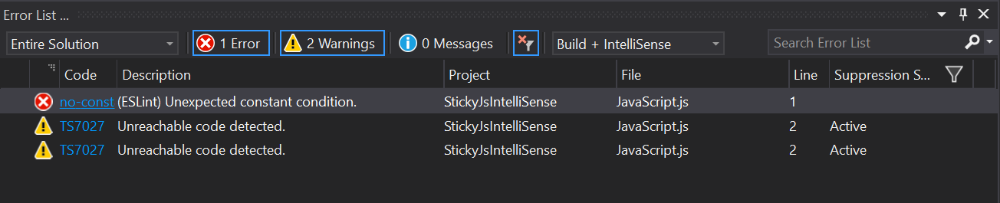
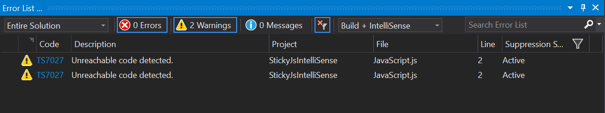

# Sticky JS/TS IntelliSense in VS 2017 RTM #

Reproduce issue reported at [https://developercommunity.visualstudio.com/content/problem/25163/javascript-intellisense-errors-not-cleared-after-c.html](https://developercommunity.visualstudio.com/content/problem/25163/javascript-intellisense-errors-not-cleared-after-c.html)

## Steps to reproduce ##

- Install Visual Studio 2017 with all default settings and ASP.NET workload
- Open solution in VS 2017 RTM
- Open `JavaScript.js` in editor window
- Wait a few seconds before `TS7027: Unreachable code detected.` and `no-const: (ESLint) Unexpected constant condition.` errors appear in `Error List` window
- Close `JavaScript.js` editor window
- Notice how eslint `no-const` error correctly disappears from the `Error List` window, but `TS7027` stays there forever

## Bonus ##

- If you keep opening and closing files, this error can even sometimes start appearing multiple times for the same line in code

## Screenshots ##

Editor open:

Editor closed:

## Related issues ##

This is something I experience in a real large solution, but can't reproduce in isolation yet.

- `TSxxxx` Errors appear in `Error List` window for files that are not part of the solution and were never open in the editor, including Visual Studio's own files like `lib.es6.d.ts` and `index.d.ts`
